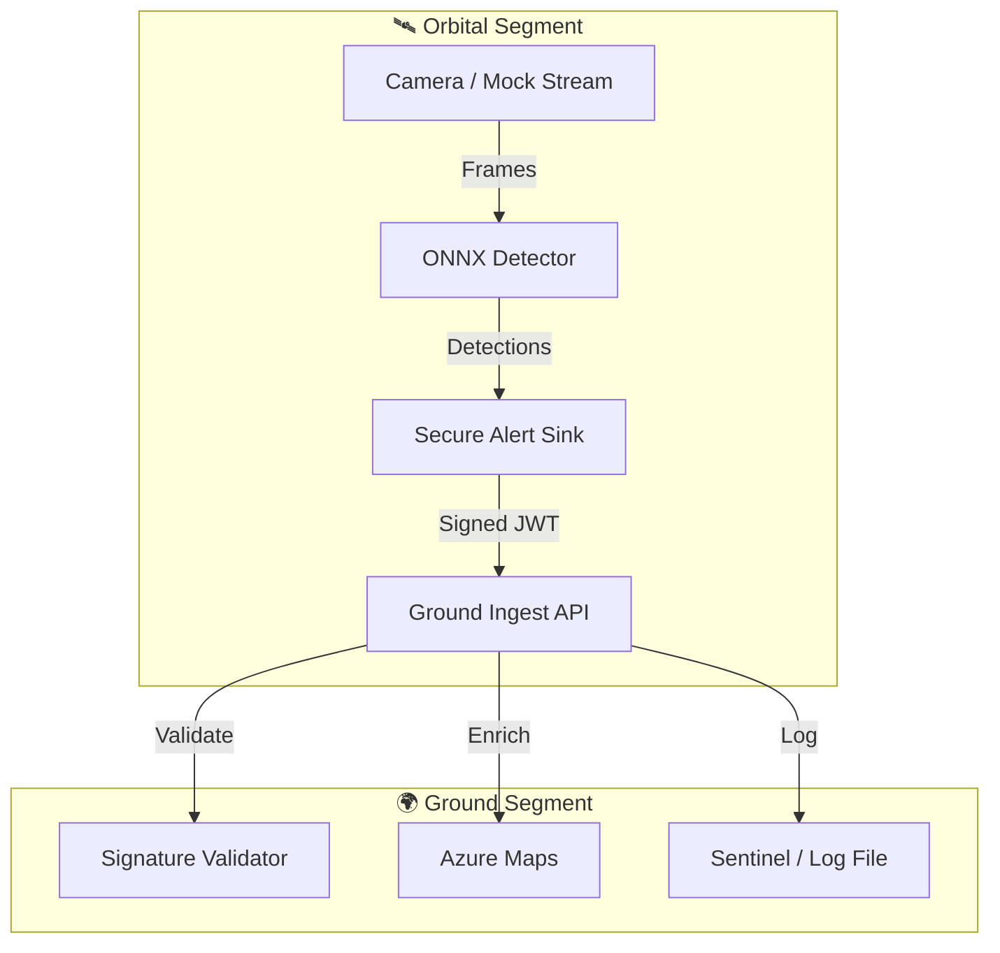

README.md
# 🛰️ Pro‑Harp: Geo‑Intelligent Orbital Security Platform

Pro‑Harp is a modular orbital security solution built on the [Azure Orbital Space SDK](https://github.com/microsoft/azure-orbital-space-sdk). It enables real-time anomaly detection from space, geospatial threat correlation, and automated enterprise response for data center protection across diverse regions.

---
## 🚀 Capabilities

- **On-Orbit AI Inference**: Detects vehicles, drones, excavation equipment, floods, and surveillance patterns using ONNX Runtime.
- **Geo-Intelligence**: Supports auto-geocoding from satellite telemetry and manual lat/long input for flexible regional coverage. The schema includes provenance fields (`telemetry_source`) and an auditable `manual_override` object to trace the source of all geo-data.
- **Containerized Deployment**: Runs lightweight ML models in orbital containers using SDK runtime.
- **Ground Integration**: Ingests alerts via .NET APIs, correlates with Azure Sentinel, and triggers Logic Apps playbooks.
- **Forensics & Compliance**: Stores signed telemetry and imagery in immutable Azure Blob Storage with Purview lineage.

---

## 🏗️ Architecture



---

## 🔁 Continuous Integration

This project uses a GitHub Actions workflow (`.github/workflows/ci-integration.yml`) for end-to-end integration testing on every push and pull request to the `Pro-Harp` branch.

The workflow performs the following steps:
1.  **Builds** the Orbital App (Python) and Ground Ingest (.NET) containers.
2.  **Deploys** the containers locally in the runner using Docker Compose.
3.  **Tests** the full loop by posting a signed anomaly from the orbital app to the ingest service.
4.  **Asserts** that the mock ingestion sink received and logged the record correctly, including tests for both auto-telemetry and manual override payloads.

This ensures that the core functionality remains stable and that the two main services are always compatible.

---

## ⚠️ Limitations

- **Latency**: Real-time detection may vary based on satellite pass frequency and downlink availability.
- **Coverage**: Detection accuracy depends on sensor resolution and orbital visibility.
- **Bandwidth Constraints**: Full imagery is not downlinked—only flagged anomalies are transmitted.
- **Model Scope**: Initial models tuned for perimeter threats; additional training required for new threat classes.

---

## 📦 Directory Structure

```
solutions/pro-harp/
├── app/                  # Orbital container (ONNX + Python)
│   ├── src/
│   ├── models/
│   ├── Dockerfile
│   ├── LICENSE
│   └── README.md
├── ground/               # Ground ingestion and SOC integration (.NET)
│   ├── ingest/
│   ├── sentinel/
│   └── logic-apps/
├── ops/                  # CI/CD, deployment, VTH tests
│   ├── ci/
│   └── deployment/
```

---

## 🔧 Operational Playbooks

### 1. Orbital Deployment
- Build container image using Dockerfile.
- Test with Virtual Test Harness (VTH) using synthetic perimeter scenarios.
- Push to Azure Container Registry (ACR).
- Deploy to satellite host via SDK runtime.

#### Local Testing
You can run the Orbital App locally without hardware:
1.  **Mock Camera**: The app supports using a static image file instead of a webcam.
    ```bash
    # Download a test image
    python app/download_test_image.py
    # Run the app (uses test_image.jpg by default if present)
    python app/src/main.py
    ```
2.  **Local Ground API**: The app is configured to send alerts to `http://localhost:5000/ingest` using a local development secret.

### 2. Ground Ingestion
- Receive anomaly payloads via .NET API.
- Enrich with Azure Maps geocoding (auto/manual).
- Normalize and ingest into Sentinel custom table.

#### KQL Correlation Rules
New advanced rules have been added to `ground/sentinel/rules/anomaly_correlation.kql`:
- **Persistent Threat**: Detects loitering (same anomaly type in same location > 3 times in 10 mins).
- **Multi-Modal Threat**: Detects coordinated activity (Person + Vehicle within 100m).

### 3. SOC Correlation
- Use KQL rules to match anomalies with CCTV, IoT, and access logs.
- Trigger Logic Apps for automated response (lockdown, dispatch, counter-drone).

### 4. Forensics & Audit
- Store alerts and imagery in Blob Storage with WORM policies.
- Register lineage in Microsoft Purview for compliance.

---

## 🔗 Upstream SDK References

- [Azure Orbital Space SDK GitHub](https://github.com/microsoft/azure-orbital-space-sdk)
- [ONNX Runtime Samples](https://github.com/microsoft/azure-orbital-space-sdk/tree/main/samples/onnx)
- [Virtual Test Harness Docs](https://github.com/microsoft/azure-orbital-space-sdk/tree/main/docs/vth)
    - *New Scenarios*: "Unauthorized Excavation" and "Coordinated Approach" added to `ops/vth/config.json`.
- [Container Runtime Guide](https://github.com/microsoft/azure-orbital-space-sdk/tree/main/docs/runtime)

---

## 📜 Licensing & Attribution

This project reuses components from the Azure Orbital Space SDK under the [MIT License](https://github.com/microsoft/azure-orbital-space-sdk/blob/main/LICENSE). All reused files include SPDX headers and attribution in source comments. See `LICENSE` and `NOTICE` for details.

---

## 🛡️ Security & Support

- Vulnerability disclosures: See `SECURITY.md`
- Contribution guidelines: See `CONTRIBUTING.md`
- Code of conduct: See `CODE_OF_CONDUCT.md`

---

```

